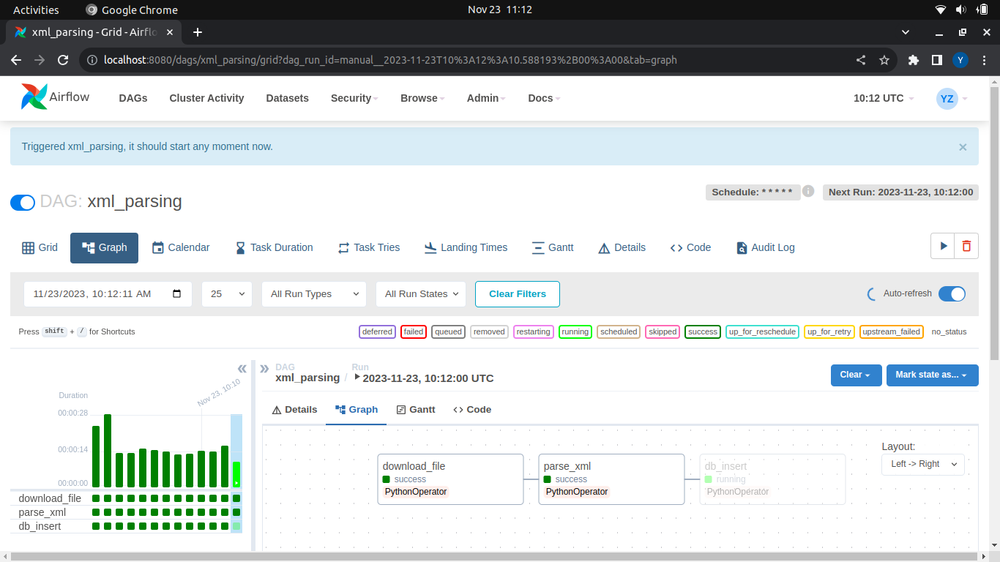
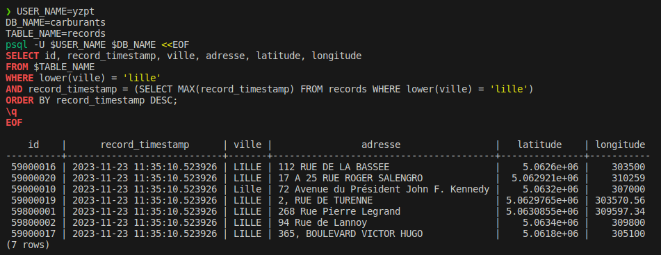

# Airflow & PostgreSQL : Prix des carburants en France

Implementing a data pipeline with Airflow and PostgreSQL through three different approaches:
- Local
- Docker
- GCP : Composer & BigQuery

<hr>

- [Airflow \& PostgreSQL : Prix des carburants en France](#airflow--postgresql--prix-des-carburants-en-france)
      - [Data source](#data-source)
  - [1. Local implementation](#1-local-implementation)
    - [1.1. Python environment](#11-python-environment)
    - [1.2. Postgresql](#12-postgresql)
    - [1.3. Airflow](#13-airflow)
      - [New terminal : starting scheduler](#new-terminal--starting-scheduler)
      - [New terminal : starting webserver](#new-terminal--starting-webserver)
      - [Airflow UI accessible at http://localhost:8080](#airflow-ui-accessible-at-httplocalhost8080)
      - [Check the data :](#check-the-data-)
      - [If psql: error: connection to server on socket "/var/run/postgresql/.s.PGSQL.5432" failed: FATAL:  Peer authentication failed for user "user\_test"](#if-psql-error-connection-to-server-on-socket-varrunpostgresqlspgsql5432-failed-fatal--peer-authentication-failed-for-user-user_test)
      - [Close the webserver](#close-the-webserver)
  - [2. Docker implementation](#2-docker-implementation)
    - [2.1. Postgresql](#21-postgresql)
    - [2.2. Airflow](#22-airflow)


<hr>

#### Data source
[https://www.prix-carburants.gouv.fr/rubrique/opendata/](https://www.prix-carburants.gouv.fr/rubrique/opendata/)

## 1. Local implementation

### 1.1. Python environment

```bash
python3 -m venv venv
source venv/bin/activate

pip install psycopg2-binary
pip install "apache-airflow[celery]==2.7.2" --constraint "https://raw.githubusercontent.com/apache/airflow/constraints-2.7.2/constraints-3.10.txt"

pip freeze > requirements.txt
```

### 1.2. Postgresql 

```bash
sudo apt install postgresql

# variables
export DB_NAME=carburants
export TABLE_NAME=records
export USERNAME=user
export PASSWORD=password

# create user and database
sudo -i -u postgres psql  <<EOF
CREATE DATABASE $DB_NAME;
CREATE USER $USERNAME WITH PASSWORD '$PASSWORD';
ALTER ROLE $USERNAME SET client_encoding TO 'utf8';
ALTER ROLE $USERNAME SET default_transaction_isolation TO 'read committed';
ALTER ROLE $USERNAME SET timezone TO 'Europe/Paris';
GRANT ALL PRIVILEGES ON DATABASE $DB_NAME TO $USERNAME;
EOF

# create table
sudo -i -u $USERNAME psql $DB_NAME <<EOF
CREATE TABLE IF NOT EXISTS $TABLE_NAME (
    record_timestamp TIMESTAMP,
    id BIGINT,
    latitude REAL,
    longitude REAL,
    cp VARCHAR(50),
    pop TEXT,
    adresse TEXT,
    ville VARCHAR(50),
    horaires TEXT,
    services TEXT,
    gazole_maj TIMESTAMP,
    gazole_prix REAL,
    sp95_maj TIMESTAMP,
    sp95_prix REAL,
    e85_maj TIMESTAMP,
    e85_prix REAL,
    gplc_maj TIMESTAMP,
    gplc_prix REAL,
    e10_maj TIMESTAMP,
    e10_prix REAL,
    sp98_maj TIMESTAMP,
    sp98_prix REAL,
    PRIMARY KEY (record_timestamp, id)
);
EOF
```

### 1.3. Airflow

```bash
# init airflow
export AIRFLOW_HOME=$(pwd)
airflow db init
airflow users create --username admin --firstname Yohann --lastname Zapart --role Admin --email yohann@zapart.com

# airflow.cfg --> don't load example dags
sed -i 's/load_examples = True/load_examples = False/g' airflow.cfg
```
#### New terminal : starting scheduler

```bash
# starting scheduler
cd <project_path>
source venv/bin/activate
export AIRFLOW_HOME=$(pwd)
airflow scheduler
```

#### New terminal : starting webserver

```bash
cd <project_path>
source venv/bin/activate
export AIRFLOW_HOME=$(pwd)
airflow webserver --port 8080
```

#### Airflow UI accessible at [http://localhost:8080](http://localhost:8080)



#### Check the data

```bash
psql -U $USERNAME $DB_NAME <<EOF
SELECT id, record_timestamp, ville, adresse, latitude, longitude 
FROM $TABLE_NAME 
WHERE lower(ville) = 'lille'
AND record_timestamp = (SELECT MAX(record_timestamp) FROM $TABLE_NAME WHERE lower(ville) = 'lille')
ORDER BY record_timestamp DESC;
\q
EOF
```



#### If psql: error: connection to server on socket "/var/run/postgresql/.s.PGSQL.5432" failed: FATAL:  Peer authentication failed for user "user_test"

    Then, edit the pg_hba.conf file and change the method column to password for the local connection:

    ```bash
    # TYPE  DATABASE        USER            ADDRESS                 METHOD
    local   all             all                                     password
    ```


#### Close the webserver

After closing the webserver, the process is still running in the background. To kill it, we need to find the PID and kill it.

```bash
# Read the PID from the file
PID=$(cat airflow-webserver.pid)

# Kill the process
kill -9 $PID
```

## 2. Docker implementation

### 2.1. Postgresql

...

### 2.2. Airflow

[https://airflow.apache.org/docs/docker-stack/index.html](https://airflow.apache.org/docs/docker-stack/index.html)

```bash
curl -LfO 'https://airflow.apache.org/docs/apache-airflow/2.7.3/docker-compose.yaml'
mkdir ./dags ./logs ./plugins
echo -e "AIRFLOW_UID=$(id -u)\nAIRFLOW_GID=0" > .env
docker compose up airflow-init
docker compose down --volumes --remove-orphans
docker compose up
```

